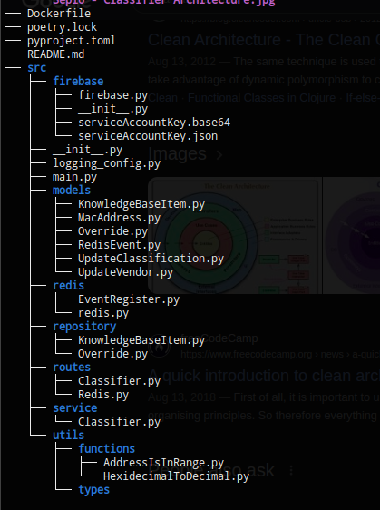
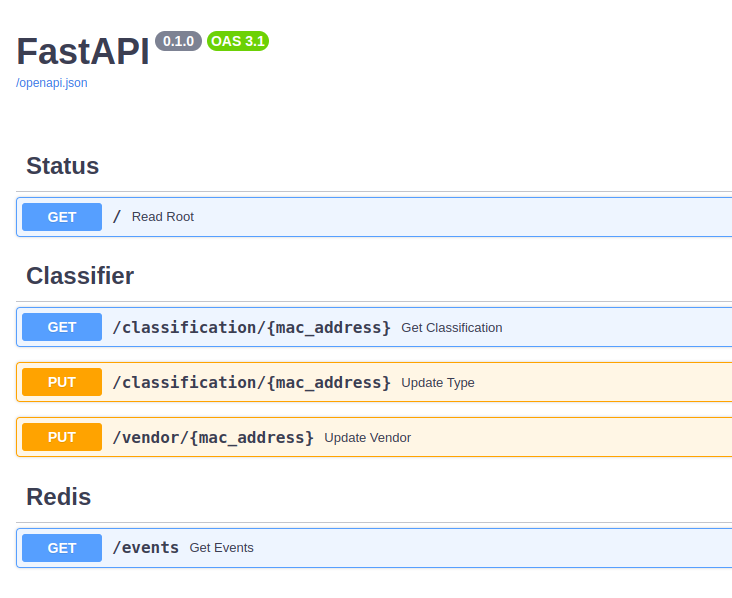

<br />
<div align="center">

  <h1 align="center">Sepio Classifier</h1>

  <h3 align="center">
    Asset classifier API microservice project
    <br />
    <br />
    <br />
  </h3>
</div>

### Architecture
||
|:--:| 
| Full view: [Figma](https://www.figma.com/board/87x7D0KPESQELjsYfqKMju/Sepio---Classifier-Architecture?node-id=0%3A1&t=nFkY2OHGzqYn8jZ8-1) |

## Access the Deployed API
### https://sepio-classifier.azurewebsites.net/docs

### Description
Sepio Classifier is a API microservice built using **FastAPI**, **Pydantic** and **Clean Architecture** with **Firebase** and **Redis** for persistence. The knowledge base was imported from the json file using a script to take it to the firestore, where the overrides are also stored in a different collection. Redis is used as a event stream, in this case for reporting inserts on the Override collection. The commits to the `main` branch will automatically trigger the **CD Pipeline** and, using Azure container registry, will deploy the container aplication to a **Azure Web App**.
Through Sepio Classifier you can check the Classification and Vendor for a given mac address. To run the application its simple with **Uvicorn** or **Docker**, just follow the instructions below. **(You'll need a provided `.env` file)**

### Project Structure


### Running the app
1. Clone the repo or download the ZIP.

2. Place the provided `.env` file in the root of the project (Where the Dockerfile is).
#### Option 1 using Docker
You'll need `docker` installed to run the application. 


3. Confirm that you are in the root of the project (`/sepio-classifier/.`) where the `Dockerfile` file is and build the image:

```
docker build -t sepio-classifier .
```
And wait for the build to finish.

3. Run the app with docker.

```
docker run --env-file .env -p 8000:8000 sepio-classifier
``` 

#### Option 2 using Poetry and Uvicorn
3. Install the packages described at `pyproject.toml`
```
poetry install
``` 
4. Activate Poetry's environment
```
poetry shell
```
5. Run the API using Uvicorn
```
uvicorn src.main:app
```

These commands will start the API that will be available on your machine's ports `8000` (The port needs to be free for the application to run).
Now just open your browser of choice and go to http://localhost:8000/docs to test the API.
Test with any of the mac addresses in the Knowledge Base json file. And don't forget to test the Override feature!

